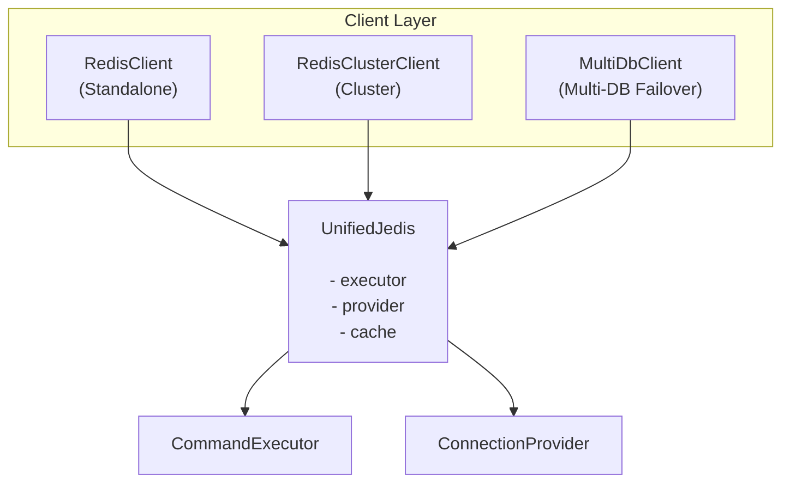

# Redis Client Components Overview
## Overview
This document provides a high-level overview of the Jedis client architecture, focusing on `RedisClient`, `RedisClusterClient`, and the experimental `MultiDbClient`. The architecture is built on two core abstractions:

1. **ConnectionProvider** - Manages connections to Redis servers
2. **CommandExecutor** - Executes Redis commands with various strategies (retry, cluster routing, circuit breaker)

All client implementations extend `UnifiedJedis`, which delegates command execution to a `CommandExecutor` that uses a `ConnectionProvider` to obtain connections.

---

## Architecture Diagram

---

## Core Components
### UnifiedJedis
**Location:** `src/main/java/redis/clients/jedis/UnifiedJedis.java`

**Responsibilities:**
- Base implementation class for all Redis clients
- Implements all Redis command interfaces
- Delegates command execution to `CommandExecutor`
- Manages client-side caching (CSC) when enabled

**Key Fields:**
```java
protected final ConnectionProvider provider;
protected final CommandExecutor executor;
protected final CommandObjects commandObjects;
private final Cache cache;
```

**Key Methods:**
- All Redis commands (GET, SET, HGET, etc.) - delegates to `executor.executeCommand()`
- `close()` - closes the executor (which closes the provider)

---

## CommandExecutor Hierarchy
### Interface: CommandExecutor
**Location:** `src/main/java/redis/clients/jedis/executors/CommandExecutor.java`

```java
public interface CommandExecutor extends AutoCloseable {
  <T> T executeCommand(CommandObject<T> commandObject);
}
```

### Implementations
#### SimpleCommandExecutor
**Location:** `src/main/java/redis/clients/jedis/executors/SimpleCommandExecutor.java`

**Characteristics:**
- Simplest implementation
- Uses a single `Connection` directly
- No retry logic
- No connection pooling
- **Use Case:** Pipeline, Transaction (managed connection)

**Execution Flow:**
```
executeCommand() → connection.executeCommand()
```

---

#### DefaultCommandExecutor
**Location:** `src/main/java/redis/clients/jedis/executors/DefaultCommandExecutor.java`

**Characteristics:**
- Uses `ConnectionProvider` to get connections
- Connection pooling support
- No retry logic
- **Use Case:** RedisClient (standalone) without retry settings

**Execution Flow:**
```
executeCommand() → provider.getConnection() → connection.executeCommand() → close connection
```

---

#### RetryableCommandExecutor
**Location:** `src/main/java/redis/clients/jedis/executors/RetryableCommandExecutor.java`

**Characteristics:**
- Retry logic with exponential backoff
- Configurable `maxAttempts` and `maxTotalRetriesDuration`
- Handles `JedisConnectionException` with backoff
- Deadline-based retry termination
- **Use Case:** RedisClient with retry settings configured

**Configuration:**
```java
RetryableCommandExecutor(provider, maxAttempts, maxTotalRetriesDuration)
```

**Execution Flow:**
```
executeCommand()
  ├─ for (attempts = maxAttempts; attempts > 0; attempts--)
  │   ├─ provider.getConnection()
  │   ├─ connection.executeCommand()
  │   └─ catch JedisConnectionException
  │       ├─ log failure
  │       ├─ exponential backoff sleep
  │       └─ retry if deadline not exceeded
  └─ throw if all attempts exhausted
```

**Backoff Formula:**
```
sleepMillis = millisLeft / (attemptsLeft * (attemptsLeft + 1))
```

---

#### ClusterCommandExecutor
**Location:** `src/main/java/redis/clients/jedis/executors/ClusterCommandExecutor.java`

**Characteristics:**
- Cluster-aware routing based on hash slots
- Handles MOVED/ASK redirections
- Supports broadcast commands (ALL_SHARDS, ALL_NODES)
- Round-robin distribution for keyless commands
- Retry logic with cluster topology awareness
- Replica connection support
- **Use Case:** RedisClusterClient

**Configuration:**
```java
ClusterCommandExecutor(provider, maxAttempts, maxTotalRetriesDuration, flags)
```

**Request Policies:**
- `DEFAULT` - Single-shard routing based on key hash slot
- `ALL_SHARDS` - Broadcast to all primary nodes
- `ALL_NODES` - Broadcast to all nodes (including replicas)
- `MULTI_SHARD` - Multi-key commands spanning shards
- `SPECIAL` - Special handling (SCAN, FT.CURSOR, etc.)

**Execution Flow:**
```
executeCommand()
  ├─ Determine request policy from command flags
  ├─ ALL_SHARDS → broadcastCommand(primaryOnly=true)
  ├─ ALL_NODES → broadcastCommand(primaryOnly=false)
  └─ DEFAULT
      ├─ if keyless → executeKeylessCommand() (round-robin)
      └─ else → doExecuteCommand() (slot-based routing)
          ├─ Calculate hash slot from key
          ├─ provider.getConnection(slot)
          ├─ connection.executeCommand()
          └─ Handle MOVED/ASK redirections
              ├─ MOVED → update slot cache, retry
              └─ ASK → send ASKING, execute on target
```

**Key Features:**
- **Slot-based routing:** Uses CRC16 hash to determine target shard
- **Redirection handling:** Follows MOVED (permanent) and ASK (temporary) redirects
- **Topology refresh:** Updates cluster topology on MOVED responses
- **Round-robin:** Distributes keyless commands across cluster nodes

---

#### MultiDbCommandExecutor
**Location:** `src/main/java/redis/clients/jedis/mcf/MultiDbCommandExecutor.java`

**Characteristics:**
- Circuit breaker pattern (Resilience4j)
- Retry logic with exponential backoff
- Multi-database failover (DR, backup, active-active)
- Automatic failover on circuit breaker OPEN state
- Health check integration
- **Experimental** feature
- **Use Case:** MultiDbClient for high availability

**Configuration:**
```java
MultiDbCommandExecutor(multiDbConnectionProvider)
```

**Execution Flow:**
```
executeCommand()
  ├─ database = provider.getDatabase() (active database)
  ├─ Decorate with Resilience4j:
  │   ├─ withCircuitBreaker(database.circuitBreaker)
  │   ├─ withRetry(database.retry)
  │   └─ withFallback(exceptions, failoverHandler)
  ├─ Execute: handleExecuteCommand()
  │   ├─ database.getConnection()
  │   ├─ connection.executeCommand()
  │   └─ catch exceptions tracked by circuit breaker
  └─ On circuit breaker OPEN
      ├─ databaseFailover() (switch to next healthy database)
      └─ retry on new database
```

**Circuit Breaker States:**
- `CLOSED` - Normal operation, tracking failures
- `OPEN` - Too many failures, reject requests, trigger failover
- `HALF_OPEN` - Testing if database recovered

**Failover Strategy:**
- Weighted selection of healthy databases
- Automatic failback to higher-priority databases
- Health check probing (PING or lag-aware strategies)

---

## ConnectionProvider Hierarchy
### Interface: ConnectionProvider
**Location:** `src/main/java/redis/clients/jedis/providers/ConnectionProvider.java`

```java
public interface ConnectionProvider extends AutoCloseable {
  Connection getConnection();
  Connection getConnection(CommandArguments args);
  Map<?, ?> getConnectionMap();
  Map<?, ?> getPrimaryNodesConnectionMap();
}
```

### Implementations
#### ManagedConnectionProvider
**Location:** `src/main/java/redis/clients/jedis/providers/ManagedConnectionProvider.java`

**Characteristics:**
- Single managed connection
- No pooling
- Connection set externally
- **Use Case:** Pipeline, Transaction

**Key Methods:**
```java
setConnection(Connection connection)  // Set the managed connection
getConnection() → connection          // Return the same connection
```

---

#### PooledConnectionProvider
**Location:** `src/main/java/redis/clients/jedis/providers/PooledConnectionProvider.java`

**Characteristics:**
- Apache Commons Pool2 for connection pooling
- Configurable pool settings (maxTotal, maxIdle, minIdle)
- Connection validation
- **Use Case:** RedisClient (standalone)

**Configuration:**
```java
PooledConnectionProvider(hostAndPort, clientConfig, poolConfig)
```

**Key Methods:**
```java
getConnection() → pool.getResource()
getConnection(args) → pool.getResource()  // Ignores args for standalone
```

**Pool Configuration:**
- `maxTotal` - Maximum connections in pool
- `maxIdle` - Maximum idle connections
- `minIdle` - Minimum idle connections
- `testOnBorrow` - Validate connection before use
- `testWhileIdle` - Validate idle connections

---

#### ClusterConnectionProvider
**Location:** `src/main/java/redis/clients/jedis/providers/ClusterConnectionProvider.java`

**Characteristics:**
- Cluster-aware connection management
- Slot-based routing (16384 slots)
- Connection pool per cluster node
- Automatic topology refresh
- Replica connection support
- **Use Case:** RedisClusterClient

**Configuration:**
```java
ClusterConnectionProvider(clusterNodes, clientConfig, poolConfig)
```

**Key Methods:**
```java
getConnection(CommandArguments args)
  ├─ Extract hash slots from keys
  ├─ Determine target slot
  └─ getConnectionFromSlot(slot) → pool for that slot's primary node

getConnection(HostAndPort node)
  └─ Get connection to specific node

getReplicaConnection(CommandArguments args)
  └─ Get connection to replica for read operations
```

**Slot Mapping:**
- Maintains mapping: `slot → HostAndPort → ConnectionPool`
- CRC16 hash algorithm: `slot = CRC16(key) % 16384`
- Handles hash tags: `{user}:123` → hash only `user`

**Topology Management:**
- Initial topology discovery via `CLUSTER SLOTS` or `CLUSTER NODES`
- Periodic refresh based on configuration
- On-demand refresh on MOVED redirections

---

#### SentineledConnectionProvider
**Location:** `src/main/java/redis/clients/jedis/providers/SentineledConnectionProvider.java`

**Characteristics:**
- Sentinel-aware connection management
- Automatic master failover detection
- Listens to sentinel events (+switch-master)
- Connection pool to current master
- **Use Case:** RedisSentinelClient

**Configuration:**
```java
SentineledConnectionProvider(masterName, sentinels, clientConfig, poolConfig)
```

**Key Methods:**
```java
getConnection() → pool.getResource()  // Connection to current master
getCurrentMaster() → HostAndPort      // Current master endpoint
```

**Failover Handling:**
- Subscribes to sentinel pub/sub channels
- Listens for `+switch-master` events
- Automatically recreates pool on master change
- Validates new master before switching

---

#### MultiDbConnectionProvider
**Location:** `src/main/java/redis/clients/jedis/mcf/MultiDbConnectionProvider.java`

**Characteristics:**
- Multiple database endpoints with isolated pools
- Weighted database selection
- Circuit breaker per database (Resilience4j)
- Health check integration (PING, lag-aware)
- Automatic failover and failback
- Database switch event listeners
- **Experimental** feature
- **Use Case:** MultiDbClient for DR/backup/active-active

**Configuration:**
```java
MultiDbConnectionProvider(multiDbConfig)
  ├─ DatabaseConfig[] - array of database endpoints
  ├─ RetryConfig - retry settings per database
  ├─ CircuitBreakerConfig - failure detection settings
  ├─ HealthCheckStrategy - PING or lag-aware
  └─ Failback settings
```

**Key Concepts:**

**Database:**
- Each database has:
  - `TrackingConnectionPool` - connection pool
  - `CircuitBreaker` - failure tracking
  - `Retry` - retry configuration
  - `weight` - selection priority (0.0-1.0)
  - `HealthCheck` - health monitoring

**Active Database Selection:**
```
getDatabase() → activeDatabase (highest weight healthy database)
```

**Failover Process:**
```
1. Circuit breaker detects failures
2. Circuit breaker transitions to OPEN state
3. MultiDbCommandExecutor triggers failover
4. Select next healthy database by weight
5. Switch activeDatabase
6. Emit DatabaseSwitchEvent
7. Continue operations on new database
```

**Failback Process:**
```
1. Periodic health check (background thread)
2. Detect higher-priority database is healthy
3. Automatic failback to higher-priority database
4. Emit DatabaseSwitchEvent
```

**Health Check Strategies:**
- `PingStrategy` - Simple PING command
- `LagAwareStrategy` - Check replication lag (for active-active)

**Key Methods:**
```java
getDatabase() → Database                    // Get active database
getConnection() → activeDatabase.getConnection()
setActiveDatabase(endpoint)                 // Manual failover
setDatabaseSwitchListener(listener)         // Listen to switch events
```

---

## Client Implementations
### RedisClient (Standalone)
**Location:** `src/main/java/redis/clients/jedis/RedisClient.java`

**Builder:** `StandaloneClientBuilder`

**Default Configuration:**
```
ConnectionProvider: PooledConnectionProvider
CommandExecutor: DefaultCommandExecutor (or RetryableCommandExecutor if retry configured)
```

**Usage:**
```java
RedisClient client = RedisClient.builder()
    .hostAndPort("localhost", 6379)
    .password("secret")
    .poolConfig(poolConfig)
    .build();

String value = client.get("key");
client.close();
```

**With Retry:**
```java
RedisClient client = RedisClient.builder()
    .hostAndPort("localhost", 6379)
    .maxAttempts(3)
    .maxTotalRetriesDuration(Duration.ofSeconds(10))
    .build();
```

---

### RedisClusterClient
**Location:** `src/main/java/redis/clients/jedis/RedisClusterClient.java`

**Builder:** `ClusterClientBuilder`

**Default Configuration:**
```
ConnectionProvider: ClusterConnectionProvider
CommandExecutor: ClusterCommandExecutor
```

**Usage:**
```java
Set<HostAndPort> nodes = new HashSet<>();
nodes.add(new HostAndPort("localhost", 7000));
nodes.add(new HostAndPort("localhost", 7001));

RedisClusterClient client = RedisClusterClient.builder()
    .nodes(nodes)
    .maxAttempts(5)
    .maxTotalRetriesDuration(Duration.ofSeconds(30))
    .build();

String value = client.get("key");
client.close();
```

**Cluster-Specific Features:**
- Automatic slot-based routing
- MOVED/ASK redirection handling
- Broadcast commands (FLUSHALL, SCRIPT LOAD)
- Multi-key operations validation

---

### MultiDbClient (Experimental)
**Location:** `src/main/java/redis/clients/jedis/MultiDbClient.java`

**Builder:** `MultiDbClientBuilder`

**Default Configuration:**
```
ConnectionProvider: MultiDbConnectionProvider
CommandExecutor: MultiDbCommandExecutor
```

**Usage:**
```java
DatabaseConfig primary = DatabaseConfig.builder()
    .endpoint(new HostAndPort("primary.redis.com", 6379))
    .clientConfig(clientConfig)
    .weight(1.0f)  // Highest priority
    .build();

DatabaseConfig dr = DatabaseConfig.builder()
    .endpoint(new HostAndPort("dr.redis.com", 6379))
    .clientConfig(clientConfig)
    .weight(0.5f)  // Lower priority
    .build();

MultiDbClient client = MultiDbClient.builder()
    .databases(primary, dr)
    .circuitBreakerConfig(circuitBreakerConfig)
    .retryConfig(retryConfig)
    .failbackCheckInterval(Duration.ofSeconds(30))
    .databaseSwitchListener(event -> {
        System.out.println("Switched to: " + event.getDatabase());
    })
    .build();

String value = client.get("key");  // Automatically fails over on errors
client.close();
```

**Multi-DB Features:**
- Circuit breaker per database
- Automatic failover on failures
- Automatic failback to higher-priority databases
- Health check monitoring
- Database switch event notifications

---

## Builder Pattern Hierarchy
### AbstractClientBuilder
**Location:** `src/main/java/redis/clients/jedis/builders/AbstractClientBuilder.java`

**Common Configuration:**
- `clientConfig` - JedisClientConfig (auth, SSL, timeout, protocol)
- `poolConfig` - GenericObjectPoolConfig (pool settings)
- `cacheConfig` - Client-side caching configuration
- `jsonObjectMapper` - JSON serialization
- `maxAttempts` - Retry attempts
- `maxTotalRetriesDuration` - Retry deadline

**Template Methods:**
```java
protected abstract ConnectionProvider createDefaultConnectionProvider();
protected abstract CommandExecutor createDefaultCommandExecutor();
protected abstract void validateSpecificConfiguration();
```

**Builder Hierarchy:**
```
AbstractClientBuilder
  ├─ StandaloneClientBuilder → RedisClient
  ├─ ClusterClientBuilder → RedisClusterClient
  ├─ SentinelClientBuilder → RedisSentinelClient
  └─ MultiDbClientBuilder → MultiDbClient
```

---

## Execution Flow Examples
### Example 1: Simple GET Command (RedisClient)
```
client.get("mykey")
  ↓
UnifiedJedis.get("mykey")
  ↓
executor.executeCommand(CommandObject<String>)
  ↓
DefaultCommandExecutor.executeCommand()
  ├─ provider.getConnection()
  │   ↓
  │   PooledConnectionProvider.getConnection()
  │   └─ pool.getResource() → Connection
  ├─ connection.executeCommand(GET mykey)
  └─ connection.close() (return to pool)
  ↓
Return "value"
```

---

### Example 2: GET Command with Retry (RedisClient)
```
client.get("mykey")
  ↓
UnifiedJedis.get("mykey")
  ↓
executor.executeCommand(CommandObject<String>)
  ↓
RetryableCommandExecutor.executeCommand()
  ├─ Attempt 1:
  │   ├─ provider.getConnection()
  │   ├─ connection.executeCommand(GET mykey)
  │   └─ JedisConnectionException thrown
  ├─ Sleep (exponential backoff)
  ├─ Attempt 2:
  │   ├─ provider.getConnection()
  │   ├─ connection.executeCommand(GET mykey)
  │   └─ Success!
  └─ Return "value"
```

---

### Example 3: GET Command in Cluster (RedisClusterClient)
```
client.get("mykey")
  ↓
UnifiedJedis.get("mykey")
  ↓
executor.executeCommand(CommandObject<String>)
  ↓
ClusterCommandExecutor.executeCommand()
  ├─ Calculate slot: CRC16("mykey") % 16384 = 14687
  ├─ provider.getConnection(args)
  │   ↓
  │   ClusterConnectionProvider.getConnection(args)
  │   ├─ Extract slot from args: 14687
  │   ├─ Lookup node for slot: 192.168.1.10:7000
  │   └─ cache.getPool(node).getResource() → Connection
  ├─ connection.executeCommand(GET mykey)
  ├─ Receive MOVED 14687 192.168.1.11:7001
  ├─ Update slot cache
  ├─ provider.getConnection(192.168.1.11:7001)
  ├─ connection.executeCommand(GET mykey)
  └─ Return "value"
```

---

### Example 4: GET Command with Multi-DB Failover (MultiDbClient)
```
client.get("mykey")
  ↓
UnifiedJedis.get("mykey")
  ↓
executor.executeCommand(CommandObject<String>)
  ↓
MultiDbCommandExecutor.executeCommand()
  ├─ database = provider.getDatabase() → primary (weight=1.0)
  ├─ Decorate with Resilience4j:
  │   ├─ CircuitBreaker (state=CLOSED)
  │   ├─ Retry (maxAttempts=3)
  │   └─ Fallback (on circuit breaker OPEN)
  ├─ Attempt 1 on primary:
  │   ├─ database.getConnection()
  │   ├─ connection.executeCommand(GET mykey)
  │   └─ JedisConnectionException (primary is down!)
  ├─ Circuit breaker records failure
  ├─ Retry attempt 2 on primary:
  │   └─ JedisConnectionException
  ├─ Circuit breaker records failure
  ├─ Retry attempt 3 on primary:
  │   └─ JedisConnectionException
  ├─ Circuit breaker transitions to OPEN
  ├─ Fallback triggered:
  │   ├─ databaseFailover()
  │   ├─ Select next healthy database → dr (weight=0.5)
  │   ├─ setActiveDatabase(dr)
  │   └─ Emit DatabaseSwitchEvent
  ├─ Recursive call: executeCommand() on dr
  │   ├─ database.getConnection()
  │   ├─ connection.executeCommand(GET mykey)
  │   └─ Success!
  └─ Return "value"
```


